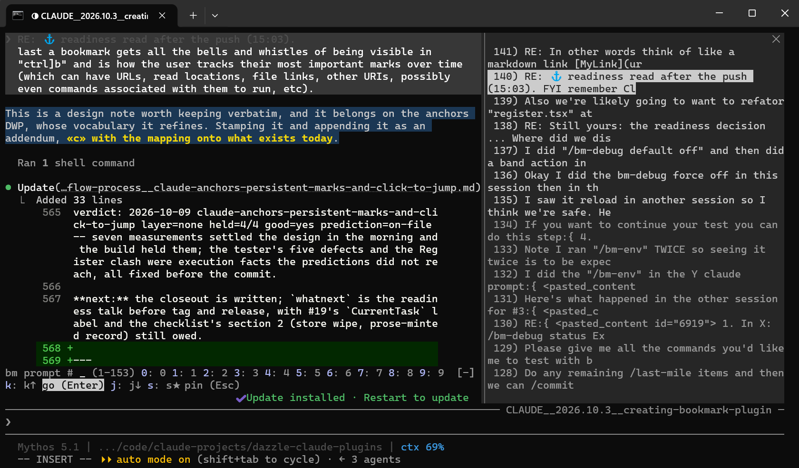

# Bookmarks

Vim-style marks, a reading position, a numbered prompt history and durable bookmarks inside a Claude Code conversation. Mark a line with a letter and jump back to it from anywhere; keep your place while you scroll; browse every prompt you have typed; and let Claude cite earlier places in the conversation as links you can click to jump there.

<p align="center">
  <picture>
    
  </picture>
  <br>
  <sub>In use: the prompts pane on the right, a marked line with its tag, a bookmark link Claude wrote in a reply, and the band above the input box.</sub>
</p>

**Pre-alpha.** In daily use in Win11 (Windows Terminal, Claude Code 2.1.288 to 2.1.296, fullscreen renderer). macOS and Linux are expected to work but have not been tried. The key layout will still change. The state of the plugin, with every known issue and what is coming, is in [docs/status.md](https://github.com/DazzleML/claude-bookmarks/blob/main/docs/status.md).

*Reviewers: everything the plugin sets, runs, reads, writes and sends is listed under [What it runs, reads, writes and sends](#what-it-runs-reads-writes-and-sends) below.*

## What it does

- **Marks.** Select a line in any reply or prompt, press the leader and `m` and a letter `a`-`z`. The line lights up where it sits. With nothing freshly selected, the letter marks the message at the top of your screen.
- **Jumps.** The leader, `'`, and the letter scrolls back to that mark from anywhere and lights the line again; the jump pane lists the marks you have.
- **The reading position.** `Space Space` after the leader keeps your place: once to go there, again to return to where you were, even after new replies arrived below.
- **Prompt history.** `p` after the leader lists every prompt of the conversation, numbered from your first, including the ones from before the plugin was loaded. Type a number or browse with `j`/`k`, then `Enter`. Pin the ones you keep returning to.
- **Bookmarks.** A permanent, addressable place: a `file:` link to a readable export of the message, with the message's id, transcript line and byte range in the link. Promote any mark into one; the link lands on your clipboard.
- **Claude cites with bookmarks.** Claude has a `bookmark` tool: a verbatim fragment of a message and a label in, a markdown link out. In its reply the link is drawn with an anchor marker: a click jumps there and highlights the words; a ctrl-click opens the bookmark's file in your markdown editor. Your bookmarks and Claude's are separate lists; Claude never writes on yours unless you ask.
- **Back and forward.** Every jump is remembered, like vim's jumplist.
- **Works while you type.** The leader works with a draft in the input box and while Claude is working; the draft is untouched. Highlights change only what is drawn on your screen, never what Claude reads or what the session file holds.

The leader is `Ctrl+]`, Claude Code's own `abovePrompt:focus` action bound to one key; the one-line binding is in the [setup section of the full README](https://github.com/DazzleML/claude-bookmarks/blob/main/README.md#set-up-the-leader). Every key, grouped by where the keyboard is: [docs/keys.md](https://github.com/DazzleML/claude-bookmarks/blob/main/docs/keys.md). Each feature in detail: [docs/usage.md](https://github.com/DazzleML/claude-bookmarks/blob/main/docs/usage.md). New to vim-style keys: the [tutorial](https://github.com/DazzleML/claude-bookmarks/blob/main/docs/tutorial.md). When something does not work: [troubleshooting](https://github.com/DazzleML/claude-bookmarks/blob/main/docs/troubleshooting.md).

## Install

Install from one place only. Installed from the Anthropic plugin directory and from a marketplace at the same time, the plugin would load twice and draw two bands.

From the directory, use its install flow. From this repository, which is also a marketplace, on Claude Code 2.1.275 or later:

```
/plugin install bookmarks --marketplace DazzleML/claude-bookmarks
```

Then bind the leader (one line in `~/.claude/keybindings.json`), switch to the fullscreen renderer with `/tui fullscreen`, restart Claude Code, and check with `/bm-env`. To work on the plugin, load this folder directly: `claude --plugin-dir /path/to/claude-bookmarks/plugin`.

## What it runs, reads, writes and sends

The plugin is a Claude Code mod: TypeScript that runs inside Claude Code's own process through its plugin API. It installs nothing and needs no package manager. The same facts in plain language, with how to remove everything: [PRIVACY.md](https://github.com/DazzleML/claude-bookmarks/blob/main/PRIVACY.md).

**Sets.** One environment variable, `CONVO_BOOKMARKS_DEBUG`, in the plugin's own process when you type `/bm-debug on` or `off`: it turns the debug echo on or off for that conversation and dies with the process. No configuration file, settings file, start-up file or instructions file is written or edited.

**Runs.** To list the prompts of a conversation and to resolve a bookmark to its transcript line, it searches the conversation's transcript file, which is often larger than the 4 MiB the plugin API will read at once, with a search program already on your machine: `sh` running `grep` where they exist (macOS, Linux, Git Bash on Windows); on Windows without them, two PowerShell scripts shipped in this folder, `hooks/scripts/user-rows.ps1` (14 lines) and `hooks/scripts/grep-offsets.ps1` (17 lines), run as `powershell -NoProfile -NonInteractive -ExecutionPolicy Bypass -File <script>`. In both cases the file path and the search text are passed as separate arguments, never spliced into a command string, so the text you select or Claude asks for cannot become a command. The program's output is read back by the plugin and goes nowhere else; each run is capped at 60 seconds. Nothing else is executed.

**Reads.** The conversation's transcript, which Claude Code keeps on disk under its config folder (`~/.claude/projects/<project>/<session id>.jsonl`, or `CLAUDE_CONFIG_DIR`): it is read, never written. The environment variables `CLAUDE_CONFIG_DIR`, `CLAUDE_USER_DIR`, `HOME` or `USERPROFILE` (to find those folders), `CONVO_BOOKMARKS_DEBUG` (the debug echo), and `DCC_PATCH_H`, `DCC_PATCHES`, `DCC_PATCHER` (shown by `/bm-env` when the companion patched build of Claude Code is in use; absent otherwise). Your mouse selection, through the plugin API, to know which line to mark. The prompt box, when you submit or edit it, to catch the plugin's own `/bm-` commands and to keep your draft intact while a pane is open; anything else you type passes through untouched and is not stored.

**Writes.** Marks, pinned prompts, reading positions, prompt lists and the jumplist, per conversation, in Claude Code's own plugin store (`~/.claude/plugins/store/bookmarks_inline-<id>.json`). Bookmarks in your own folder, `~/claude/bookmarks/` (or `CLAUDE_USER_DIR`): one JSON register per conversation under `sessions/` and one markdown file per bookmarked message, which you can read and edit. A debug log per conversation, `~/claude/bookmarks/debug/<session id>.log`, kept to its last 400 lines, holding key names, pane and jump events and never the text you type. The clipboard, when you promote a mark (the bookmark's link) or when a jump is refused (a phrase of the message to search for). Every path is computed from your home folder and the conversation's id; none is a file another tool runs or obeys. Nothing is written into the session file, and nothing under `~/.claude` other than the plugin store.

**Sends.** Nothing. The plugin makes no network connections and contacts no service. The one thing the model sees is its own `bookmark` tool and the links it returns.

## Licence

GPL-3.0; see [LICENSE](LICENSE). Source, issues and the roadmap: [github.com/DazzleML/claude-bookmarks](https://github.com/DazzleML/claude-bookmarks).
